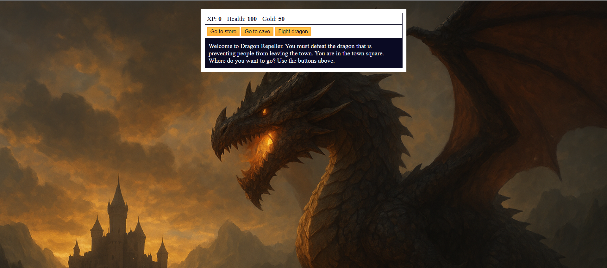

# 🐉 Dragon Repeller

A fun **JavaScript RPG game** where you fight monsters, collect gold, and eventually defeat the mighty dragon!  
Built with **HTML, CSS, and JavaScript**.

## 🎮 Demo
🔗https://github.com/SIVAPRASANNA2812/dragonRepeller.git

---

## 📸 Screenshot
<!-- Replace with actual screenshot if available -->

---

## 🚀 Features
- Travel between different locations (Town, Store, Cave).
- Buy and sell weapons.
- Fight different monsters with increasing difficulty.
- Gain XP, gold, and upgrade your stats.
- Defeat the dragon to win the game!

---

## 🛠️ Built With
- **HTML5** - Structure of the game.
- **CSS3** - Styling and layout.
- **JavaScript (ES6)** - Game logic and interactivity.

---

## 📂 Project Structure
DragonRepeller/
│
├── index.html          # Main HTML file
├── styles.css          # CSS styles
├── script.js           # JavaScript logic
│
├── images/             # All game images
│   ├── dragon.jpg      # Your dragon background
│
├── README.md           # Project description for GitHub

